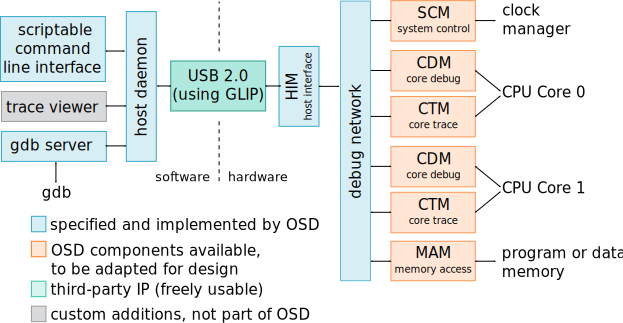
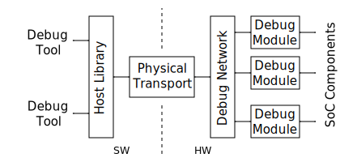
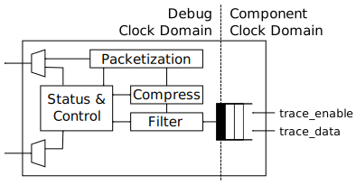

# Introduction

## About Open SoC Debug

Systems-on-Chip (SoCs) have become embedded deeply into our lives.
Most of the time we enjoy the way they serve their purpose without getting in the way.
Until they don't.
In those moments, we as engineers are reminded of the complex interplay between software and hardware in SoCs.
We might pose questions like "How does my software execute on the chip?" or "Why is it showing this exact behavior?"
To answer these questions we need insight into the system that executes the software.
We gain this insight through the debug infrastructure integrated into the SoC.

Even though debug infrastructure is an essential part of any SoC design, most people consider creating it more of a necessary chore than an exciting endeavor.
Therefore, most vendors today include debug infrastructure that follows one of two major specifications: [ARM CoreSight](http://www.arm.com/products/system-ip/debug-trace/) and [NEXUS 5001](http://nexus5001.org/) (officially called "IEEE-ISTO 5001").
Unfortunately, none of these specifications are fully open, they cannot be used without any money involved.

The Open SoC Debug (OSD) specification was created to close this gap.
Three key messages guide its design.

* **OSD is a truly open (source) specification.**
  Without any committee membership required or royalty fees to be payed, anyone can freely
    - share and modify the specification itself, and
    - create and distribute implementations of the specification for any purpose.
- **OSD is for debugging and tracing.**
  A debugging infrastructure by itself is not a solution, but a toolbox providing the right tool for the task.
  Some bugs are best hunted using run-control debugging, some are better found using tracing.
  OSD supports both, enabling hardware and software developers to pick what's best for their needs.
- **OSD provides the common and enables the special.**
  SoCs came to live because they allow reuse of components and specialization at the same time, letting hardware designers focus on the unique challenges without re-inventing the wheel. OSD follows this lead. Common IP blocks, interfaces and software tools can be re-used, and multiple extension vectors allow for easy customization where necessary.

## Scope
By implementing Open SoC Debug, a SoC gains the following features (to a varying and implementation-defined degree).

- Support for run-control debugging, i.e. setting breakpoints and watchpoints and reading register values. In short, all you need to attach a debugger like GDB to the SoC.
- Support for tracing, i.e. non-intrusively observing the program execution on the SoC.
- Support for remotely controlling the SoC during development, e.g. starting the CPUs,  resetting the system, and reading and writing the memories.

To provide these features, this specification defines
- an extensible debug system architecture, covering both hardware and host software,
- templates with well-defined interfaces for debug and trace IP blocks ("debug modules"),
- a set of common debug modules for the most frequent run-control debug and tracing tasks,
- a host-side software programming interface (API) for debug tools to interact with an OSD-enabled debug system.

In addition, implementations of many components described in the OSD specification are made available under a permissive open source license which can be used directly in custom designs.

## Current Status
OSD is an evolving effort.
Currently, we target the first release of the base specification and
module specification, that contain the following parts:

 * Basic interfaces and transport protocols
 * A generic and mandatory memory map for all debug modules to allow
   enumeration, capabilities and versioning
 * Basic modules for run-control and trace debugging

This is just the start that covers the very basic functionality, but more features are planned to be added to the specification in the near future:
tracing to memory instead of host, device traces, module triggering, cross-triggers, on-chip aggregation and filtering, sophisticated interconnects, just to mention a few.

## About This Document
This document gives an overview of Open SoC Debug.
The goal is to provide interested designers SoC hardware components as well as developers of debugging software tools a good understanding of the overall picture and the reasoning behind the design of OSD.
This document is not the specification itself.
Please refer to the individual sub-documents for the exact wording of the specification.

## OSD Contributions and Licensing
OSD is a community effort and anyone is invited to join.
If you are interested in giving input, reviewing our specifications or joining the Open SoC Debug team, please visit our website: [http://www.opensocdebug.org](http://www.opensocdebug.org)

### Specification License
This work is licensed under the Creative Commons
Attribution-ShareAlike 4.0 International License. To view a copy of
this license, visit
[http://creativecommons.org/licenses/by-sa/4.0/](http://creativecommons.org/licenses/by-sa/4.0/)
or send a letter to Creative Commons, PO Box 1866, Mountain View, CA
94042, USA.

You are free to share and adapt this work for any purpose as long as
you follow the following terms: (i) Attribution: You must give
appropriate credit and indicate if changes were made, (ii) ShareAlike:
If you modify or derive from this work, you must distribute it under
the same license as the original.

## Revision History

### Version 2016.1, Preview 2 (to be released)
2nd preview of initial version for discussion.

* Revised document structure.
* Added more introduction and clarified design goals.

### Version 2016.1, Preview 1 (released 2016-02-01)
1st preview of initial version for discussion.

A full revision history in all detail is available in our [Git repository](https://github.com/opensocdebug/documentation).

# High-Level Features
By implementing OSD, a SoC can easily be enhanced with advanced debug functionality. This section describes these features in more detail.

## Run-Control Debug
Run-control debugging, a.k.a. breakpoint debugging, "stop-and-stare" debugging, or just "debugging," is the most common way of finding problems in software at early stages of development.
Using software tools like the GNU Debugger (gdb) breakpoints can be set in the software code.
If this point in the program reached, the program execution is stalled and the program control is handed over to the debugger.
Using the debugger, a developer can now read register or memory values, print stack traces, and much more.
To be efficient, run-control debugging functionality needs hardware support to stop the program execution at a given time.
In addition, run-control debugging on SoC platforms is usually done remotely, i.e. the system is controlled from a host PC, as opposed to running the debugger directly on the SoC.

OSD contains all parts to add run-control debug support to a SoC.
On the hardware side, OSD interfaces with the CPU core(s) to control its behavior.
On the host side, OSD provides a daemon that GDB can connect to.
The actual debugging is then handled by GDB and the usage of OSD is transparent to the software developer.

## Tracing
Today's heterogeneous multi-core designs present new challenges to software developers.
Concurrent software distributed across multiple CPUs and hardware accelerators, interacting with complex I/O interfaces and strict real-time requirements is the new normal.
This results in new classes of bugs which are hard to find, like race conditions, deadlocks, and severely degraded performance for no obvious reason.
To find such bugs, run-control debugging is not applicable: setting a breakpoint disturbs the temporal relationship between the different threads of execution.
This disturbance to the program execution is called "probe effect" and can cause the original problem to disappear when searching for it, a phenomenon known as "Heisenbug."

Tracing avoids these problems by unobtrusively monitoring the program execution and transferring the observations off-chip.
There, the program flow can be reconstructed and the program behavior analyzed.

OSD comes with components to enable tracing for not only CPU cores, but also for any component in the SoC, such as memories, hardware accelerators, and interconnects.

## Memory Access
Reading and writing memories is an essential tool during bring-up and debugging of a SoC.
A typical use case is to write software to a program memory from the host PC, to avoid writing it for example to a SD card or flash memory and then resetting the system.

OSD ships with a module that can be attached to a memory to support reads and writes from and to memories.

## System Discovery
Users of today's debug systems know the pain: setting up a debugger on a host PC to communicate with the hardware often requires obscure configuration settings, secret switches and a bit of magic sauce to make it all work.

OSD is designed to be plug-and-play.
All hardware components are self-describing.
When a host connects to the system, it first enumerates all available components, and reads necessary configuration bits.

## Timestamping
Timestamps are monotonically increasing numbers which are attached to events generated by the debug system.
(They usually do not correspond in any way to wall-clock time.)
Timestamps enable correlation of events in different parts of the chip with each other.
Additionally, they can be used to restore order to events which are (for some reason) out of order when they arrive.

While timestamps are useful in many cases, adding them to all events generated by the debug system can significantly increase the overhead of such events.

Currently OSD supports timestamps which are full numbers of configurable width.
Some debug modules can be configured to enable or disable timestamp generation.

The timestamping method used in OSD is referred to as "source timestamps" in some debug systems.
Timestamps are added to the trace data at the source, as opposed to (e.g.) adding timestamps when the data is received by a debug adapter hardware between the SoC and the host PC.

## Security and Authentication
Any debug system, by nature, exposes much of the system internals to the outside world.
To prevent abuse of the debug system, production devices often require a developer to authenticate towards the system before being able to use the debug system.

OSD provides the infrastructure to implement such features.

# OSD By Example
Before we dive into the details of the OSD architecture, this section discusses two typical usage examples of OSD.
The first example only shows run-control debugging, the second one presents a full tracing infrastructure.

## OSD for Run-Control Debugging
Many smaller single-core designs traditionally only support run-control debugging through custom JTAG-based debug infrastructure.
OSD supports this use case well.
Its modular architecture makes it easy to implement only essential debug modules to support run-control debug, and to add advanced features such as trace later without major changes.

{#fig:overview_example_debug}

@Fig:overview_example_debug shows an example configuration of OSD for a small run-control debug scenario.
The functional system (to be attached on the right side) consists of a single-core CPU, a memory and a bus interconnect.
To this functional system the debug modules are attached.

* The System Control Module (SCM) module allows to control the system remotely: reset the system, halt the system, reset the CPUs, etc.
* The Core Debug Module (CDM) provides all functionality expected from a run-control debug system: setting breakpoints and reading CPU registers.
* The Memory Access Module (MAM) gives access to the chip's memories for loading the memories during debugging (e.g. with the program code), to verify the memory contents, or to read out memory contents during debugging.
* To show the benefits of using OSD, the example system adds another module, the Device Emulation Module UART (DEM-UART).
  This module behaves on the functional hardware side, and on the software side like a usual UART device.
  But instead of using dedicated pins, the data is transported through the debug connection.

For all mentioned components, OSD includes a full specifications which enables a custom implementation, as well as a hardware implementation that can be used unmodified or adapted to fit the interface to the custom functional system.

The debug modules are all connected to a debug network.
The OSD specification does not require a specific network topology or implementation type.
However, usually OSD implementations use a 16-bit wide, unidirectional ring network on chip (NoC), as it presents a good trade-off between area usage and performance.

To connect with a host PC, three further components are needed: the Host Interface Module (HIM) on the hardware side, a GLIP transport module, and a software daemon on the host side.

The transport of data between host and device is handled by [GLIP](http://glip.io).
GLIP is a library which abstracts the data transport between hardware and software with a bi-directional FIFO interface.
The data transport itself can happen through different physical interfaces, such as UART, JTAG, USB or PCI Express (PCIe).
In the presented example, a JTAG connection is used.
A possibly existing JTAG boundary scan interface can be re-used and a new Test Access Point (TAP) is added to the JTAG chain for the debug connection.

The Host Interface Module (HIM) connects the debug network to the FIFO-interface of GLIP.

On the software side, the OSD host daemon encapsulates the communication to the device and provides a API for various tools communicating with the debug system.
A scriptable command line interface can be used to control the system (such as reset, halt, etc.) and to read and write memories.
A gdb server provides an interface to the core debug functionality that the GNU Debugger (gdb) can connect to.
In the end, software can be debugged with an unmodified gdb (and other gdb-enabled IDEs, such as Eclipse CDT).

## OSD for Tracing
Today's debug system architectures strictly separate between run-control debugging and tracing.
The example below shows how OSD units the two worlds with a common interface, thus reducing development and maintainance effort.
Since most of the architecture is shared between run-control debugging and tracing, upgrading an existing design from run-control debugging to tracing is not a large step.

{#fig:overview_example_trace}

@Fig:overview_example_trace shows an example architecture of a OSD system with tracing support for a  dual-core design.
Most of the architecture is identical to the previous example: the host daemon, the HIM, the debug network and the SCM, CDM and MAM debug modules.
New in this example are the following parts.

* The GLIP transport library now uses USB 2.0 instead of JTAG for communication.
  This allows for higher off-chip transfer speeds to get improved visibility into the system by tracing.
* The Core Trace Module (CTM) provides program trace (a.k.a. instruction trace) support.
  It is attached to the CPU core next to the CDM.
* A graphical trace viewer can be attached to the host daemon to view the traces.
  Currently, OSD does not come with such a tool, but all interfaces are provided to easily write such a tool.

The two examples in this section have already shed a light on what is possible with OSD.
In the remainder of this document, we'll discuss OSD in more depth, starting with a more general overview of the architecture.

# The Open SoC Debug Architecture

{#fig:overview}

@Fig:overview shows the different components in an Open SoC Debug-based debug system.

* **Debug modules** (shown on the right) monitor or interact with the functional components of the SoC.
  Towards the functional SoC the interface is implementation-specific.
  Towards the debug network the modules conform to a well-defined interface, consisting of two parts:
  a register-mapped control interface, and an event data interface (i.e. to send out trace data or other unsolicited messages).
* The **debug network** is used to exchange messages between the debug modules and the host.
* The **physical transport** connects the device to a host PC.
  For most implementations, we recommend using [GLIP](http://glip.io).
* On the host side, the **OSD host library** (`libopensocdebug`) provides a programming interface (API) to the debug system.
* On top of that library, the **OSD daemon** (`opensocdebugd`) can be used to enable multiple debug tools to interact with the on-chip debug system.
* Finally, **debug tools** use the debug system to perform debugging and analysis tasks, ranging from run-control debugging to tracing and runtime verification.

All parts of the OSD architecture have been designed with extensibility in mind.
But if no or only small customizations are needed, OSD also includes default implementations of most components which can be used to get a system up and running quickly.

## Debug Modules
The debug modules either monitor a debug module or interact with it in
case of run-control debugging or special functionalities. On the other
side the debug modules generally interface the debug infrastructure
via the so called "Debug Interconnect Interface" (DII).

{#fig:debug_module_generic_if}

All debug modules have a common debug-side status and control
interface as depicted in @fig:debug_module_generic_if. It is a base register map that
contains mandatory and optional registers such as:

 * The *module class* and a module *vendor id* and *product id*, that
   support enumeration and software handling of the debug modules on
   the host
 * Enable and disable the entire module
 * Query module-specific capabilities and enable features

This interface usually runs in the debug system clock domain, while
the actual module logic is responsible for clock domain crossing
between the connected system component and the debug clock
domain. Most simply, tracing is usually done by (naturally) sampling
the trace information in the component's domain and cross the trace
event via a small buffer into the module logic that handles
packetization of the trace event.

### Register Access

The host sends register access packets to the debug modules to

 * read and write control & status registers, or
 * access a debug module functionality

For example, the host can send a `REQ_READ_REG` packet to read module
version from the defined memory address `MOD_VERSION (0x1)`. The
module will reply with a `RESP_READ_REG` containing the module
version.

It is generally allowed that debug modules can also generate such
request to query or control other debug modules.

#### Memory-Mapped I/O (MMIO) Bridge
{#fig:debug_module_mmiobridge}

OSD comes with convenience wrapper that maps the register access debug
packets to memory-mapped bus interface. As depicted in @fig:debug_module_mmiobridge this
module is especially useful for host-controlled modules, such as
run-control debugging.

The basic bus interface allows for register addresses. The data width
is configurable, for example as a processor's data width. The memory
addresses are register numbers, so that is is not possible to address
unaligned to the configured data width.

Finally, there is an `interrupt` signal that can be used to send
unsolicited events to the host, for example a `breakpoint` event. The
bridge is configured to read a value from a configured address and
send it to the host. Thereby it is possible to implement run-control
debugging without polling for events.

### Debug Events
Debug events are unsolicited messages generated from a debug
module. This can for examle be a "breakpoint hit" message from a
run-control debug module, or a trace message. In the first case the
host usually starts with a sequence of register accesses, while in
general debug events are of a fire-and-forget nature.

### Trace Modules
{#fig:generic_trace_module}

Trace modules have an overall structure as depicted in @fig:generic_trace_module. Their task is to sample trace events generated by the
hardware. This trace events can be of arbitrary sizes, but are usually
constant at a single trace module's sampling interface. Examples are:

 * A processor core's execution trace: Executed program counter,
   branch-taken or similar
 * A processor core's diagnosis trace: Functional unit utilization,
   branch predictor efficiency, etc.
 * Cache diagnosis trace: Hits/Misses, Conflicts, average memory
   access time, etc.
 * DMA controller trace: Start and end of request, average memory
   latency

Summarizing, nearly every hardware block is a candidate to generate
useful trace information.

### Clock Domains
The base functionality of a trace module is packetization of the trace
data to trace event packets. Optionally, the module may filter events
or compress the event stream. At some point it is necessary to cross
between the module's clock domain and the debug clock domain. This can
alternatively be done on the trace event sampling, at the packet
output or somewhere in between, depending on which clock is faster and
at which rates trace events are generated.

### Overflow Handling
In case the trace events are generated at a faster rate than the host
interface can transfer. This problem becomes crucial with the
increasing number of trace modules. Generally, this can be done on the
level of the debug system by a sophisticated flow control that will be
specified in later revisions. An overflow occurs if a trace event is
generated, but cannot be transferred or buffered due to backpressure
from the interconnect, but backpressure cannot be generated to the
system module. In the current specification the trace infrastructure
detects this situation, counts how many packets could not be
transfered and then transfers a `missed_events` event once it the
interface is available again.

## Transport and Switching
To route debug information to the correct debug module and to the
host, OSD uses a simple packet-based protocol. The packet size is
limited by the implementation and can be queried from the *System
Control Module (SCM)*. The minimum value for the maximum packet size
is 8.

The *Debug Interconnect Interface (DII)* defines the data format and flow control mechanism. The packet width must be at least 16 bit and currently is set fixed to 16 bit.

The debug packets contain the necessary routing and identification
information, namely the destination and the source, in their header,
which are the first two data items in a packet.

One key property of the transport & switching in the Open SoC Debug
specification is that it generally allows that debug modules exchange
packets between them. This enables on-chip trace processing,
run-control debugging from a special core or other methods to reduce
the traffic on the host interface, which is the most critical resource
in modern debugging.

{#fig:interconnect}

In general, the interconnect can have any possible topology as long as
it fulfills two basic properties: strict-ordering of packets with the
same `(src,dest)` tuple and deadlock-freedom. The first property does
forbid debug packets from one source to one destination to overtake
each other in the interconnect to allow payload data to span multiple
packets. @Fig:interconnect shows the favored topologies. The baseline
implementation is a simple ring interconnect. The ring balances well
between clock speed, required chip area and most importantly
flexibility. It can easily span the entire chip without dominating a
design.

Alternatively, other topologies may be favored. For example a low
count of debug modules favors a multiplexer interconnect. Especially
if the debug modules are all trace debugging or all run-control
debugging a bus or similar can be favorable for low debug module
counts. When the modules also communicate with each other a crossbar
may be used for high throughput, but with the disadvantage of large
area overhead.

Finally, we believe once some first tests with larger systems in the
real world have been performed, hierarchical topologies may become
favorable. Beside optimizing the resource utilization, aggregating
modules may bridge subsets of trace modules to the actual debug
interconnect to perform size optimizations on the aggregated packet
stream.

## Physical Interface
The physical interface is abstracted in Open SoC Debug as a FIFOs which transmit data between the host and the device.

{#fig:glip_overview}

While not required by OSD, we recommend building on top of [GLIP](http://www.glip.io) as depicted in @fig:glip_overview.
GLIP provides a generic FIFO interface that reliably transfers data between the host and the system.
Multiple alternatives for simulations and prototyping hardware exist.
In a silicon device, a high-speed serial interface is most probably favorable.

## Host Software
As mentioned before, the host software is not in the focus of the Open
SoC Debug project, but we strongly support development of debug
software around our infrastructure.

The basic level of the `libopensocdebug` is the packetization of debug
packets. It also provides higher-level functions, for example register
access functions or up to convenience functions to perform
module-specific operations. A debug tool can build against this
library, or alternatively start the `opensocdebugd` daemon that allows
multiplexing of one Open SoC Debug-enabled system between different
tools.

# Basic Debug Modules
In the following we will shortly introduce the core group of debug
modules which are be part of Open SoC Debug. Only two modules are
mandatory: The *Host Interface Module* to transfer data between the
debug system and the host or memory, and the *System Control Module*
that identifies the system, provides system details and controls the
system.

## Host Interface Module (HIM)
{#fig:debug_module_him}

The *Host Interface Module (HIM)* converts the debug packets to a
`length`-`value` encoded data stream, that is transferred using the
glip interconnect. This format is simple and contains the length of
the debug packet in one data item followed by the debug packet.

Alternatively, the HIM can be configured to store the debug packets to
the system memory using the memory interface.

## Host Authentication Module (HAM)
{#fig:debug_module_ham}

The system can require the host to authenticate before connecting to
the debug system, because the debug can expose confidential
information. A *HAM* implementation can for example require a token to
match or a sophisticated challenge-response protocol. If configured
the [HIM](#host-interface-module-him) will wait for the HAM to allow
the host to communicate with modules other than the HAM.

## System Control Module (SCM)
{#fig:debug_module_scm}

The *System Control Module (SCM)* is always mapped to address `1` on
the debug interconnect (`0` is the host/HIM address). The host first
queries the SCM to provide system information, like a system
identifier, the number of debug modules, or the maximum packet length.

Beside that it can be used to control the system. For that it can set
the soft reset of the processor cores and the peripherals separately
in the first specification.

## Core Debug Module (CDM)
{#fig:debug_module_cdm}

The core debug module implements run-control debugging for a processor
core. The implementation is to a certain degree core-dependent, but a
generic implementation is sketched in @fig:debug_module_cdm. It has a memory
mapped interface as described above. The debug control, status
information and core register are mapped in memory regions. The
run-control debugger (e.g., gdb) then sends register access
requests. In case of a debug event (breakpoint hit) `interrupt`
signals are asserted. As a reaction the CDM reads a defined address
and the core-specific part of the CDM generates a debug event.

Of course, other implementations are possible or may be required
depending on the interface processor implementation.

## Core Trace Module (CTM)
The *Core Trace Module (CTM)* captures trace events generated from the
processor core. The implementation is core-dependent and will be
highly configurable. Such trace events are core-internal signals, like
the completion of an instruction, the branch predictor status, memory
access delays, cache miss rates, just to name a few possibilities.

The CTM specification will define a few basic trace events and how
they can efficiently packed, because such events are usually generated
with a high rate.

## Software Trace Module (STM)
The *Software Trace Module (STM)* emits trace events that are emitted
by the software execution. Such an STM event is a tuple
`(id,value)`. There are generally two classed: user-defined and
system-generated trace events.

User-defined trace events are added by the user by instrumenting the
source code with calls to an API like `TRACE(short id, uint64_t
value)`. A debug tool can map the trace events to a visualization.

Different user threads can emit trace events interleaved. Beside this
the operating system can emit relevant trace information too. For both
reasons, there are system-generated events.

There are two ways to emit a software trace event. First there is a
set of *special purpose registers* or similar techniques used to emit
trace events. Most importantly, each trace event must be emitted
atomically. Secondly, the processor core can have hardware to emit
software trace events. For example a mode change can be emitted
without much overhead.

The generic trace interface is `enable`, `id` and `value` at the core
level and the STM handles the filtering, aggregation and packetization
as described above.

## Memory Access Module (MAM)
{#fig:debug_module_mam}

The *Memory Access module (MAM)* is used to write data to the memory
or read data back from the memory. This module can therefore be used
to initialize the memory with a program or inspect the memory
post-mortem or during run-control debugging.

The module is either connected to the system memory, other memory
blocks or the last level cache. In the presence of write-back caches
the memory access may be required to be guarded by a run-control
triggered forced writeback if necessary.

## Debug Processor Module (DPM)
{#fig:debug_module_dpm}

As mentioned in the [Introduction](#introduction) we believe in the
importance of on-chip processing of debug information. The chip
interface is the bottleneck in the entire debug infrastructure. But
the developer wants to collect as much trace events as possible to get
a complete picture of the execution. The approach to solve this
trade-off is to process trace events on the chip already. This can be
either filtering or compression as introduced with
[Trace Modules](#trace-modules), but also more complex processing of
trace events to generate processed information out of raw data.

A debug processor module is a subsystem in the debug system that can
receive debug packets, store them and process them to new debug
packets to be sent to the host. As depicted in @fig:debug_module_dpm a basic DPM
therefore contain a programmable hardware block (possibly a simple
CPU) and some local memory to execute programs from and store debug
data. A DPM can also send debug packets to configure debug modules and
set itself as destination of packets or configure filters, etc.

This subsystem may be interface from the system itself to configure
it. It may also be part of the actual system, like a core that can be
dynamically dedicated to be a DPM.

## Device Emulation Module (DEM)
It may be desired to deploy I/O modules that do not map to I/O pins,
but instead exchange transactions with the host. This may for example
be a serial terminal that send output characters to the host. Another
important use case for such modules is the emulation of devices on the
host or the simulation of a module during development of it.
