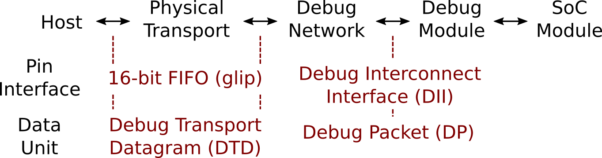

# Introduction

This document contains the specification of the interfaces and
protocols implemented in the Open SoC Debug infrastructure and
modules. Any module must follow the interfaces and protocols to be
compliant with the standard, except parts that are marked optional.

The basic interfaces are depicted in the following overview
picture. The SoC modules have individual interfaces.

## License

This work is licensed under the Creative Commons
Attribution-ShareAlike 4.0 International License. To view a copy of
this license, visit
[http://creativecommons.org/licenses/by-sa/4.0/](http://creativecommons.org/licenses/by-sa/4.0/)
or send a letter to Creative Commons, PO Box 1866, Mountain View, CA
94042, USA.

You are free to share and adapt this work for any purpose as long as
you follow the following terms: (i) Attribution: You must give
appropriate credit and indicate if changes were made, (ii) ShareAlike:
If you modify or derive from this work, you must distribute it under
the same license as the original.

## Revisions

No release so far.

## Authors

Stefan Wallentowitz

Fill in your name here!

## Reviewers

Fill in your name here!

# Hardware Interfaces

## Debug Interconnect Interface (DII)

The *Debug Interconnect Interface (DII)* is the synchronous interface
between the debug interconnect and the debug modules. It is basic
FIFO-like interface with data and handshake signals (master view):

Signal | Driver | Width | Description
------ | --------- | ----- | -----------
`data` | Master | 16 | Data item
`valid` | Master | 1 | Signals transfer in this cycle
`ready` | Slave | 1 | Acknowledge transger in this cycle
`first` | Master | 1 | This is the first item of a packet
`last` | Master | 1 | This is the last item of a packet

The following rules and restrictions apply:

 * The `valid` signal must not depend on the `ready` signal. This
   means you cannot have a combinational dependency of the `valid`
   signal on the `ready` signal in one cycle.

 * A transfer was succesfull iff `valid` and `ready` were set

 * The `first` and `last` signals are set so that they signal the
   first and last data item of a packet as described below.

A debug module in the standard case has an input interface and an
output interface, which is denoted a Debug Interface Port (DIP). Only
in rare cases one of them may be omitted.

## Debug Packet (DP)

A debug packet is defined by the following sequence of successfully
transferred data items (`valid && ready`) on the DII:

| `first` | `last` | `data` |
| ------- | ------ | ------ |
| `1` | `0` | `[15:10]` reserved, `[9:0]` destination |
| `0` | `0` | `[15:10]` type, `[9:0]` source |
| `0` | `0` | payload |
| ..  | ..  | .. | 
| `0` | `1` | payload |

The reserved bits in the first header are reserved for later use,
e.g., to support prioritized packets, packet IDs or extended
formats. The debug packet class is part of the debug protocol and
payload data is also defined in the protocol.

In this version there are no length limitations for the packets in the
protocol, but this may change in future revisions.

## Debug Transport Datagram (DTD)

The Debug Transport Datagram (DTD) encapsulates the Debug Packet into
a 16-bit wide packet with an extra `length` field preprended:

word | data
---- | ----
0 | N
1 | DP flit 0
2 | DP flit 1
.. | ..
N+1 | DP flit N

Due to the native width the debug transport datagram is the interface
format from the host or similar.

# Debug Packet Types

In this section the different types of debug packets are defined. A
debug packet encodes its type in the upper six bit of the second data
word. The debug packet type are of the following classes:

 * *Register accesses* are the straight-forward read and write
    operations to a debug module. Usually, most operations can be
    mapped to such requests.

 * *Trace Events* are unsolicited events generated by the debug
    modules.

## Register Access

Register access packets are the standard packets to access a debug
module and a basic set of registers must exist in each module.

### `REQ_READ_REG`

Word | Description
---- | -----------
0 | Register Address

### `REQ_WRITE_REG`

Word | Desription
---- | ----------
0 | Register Address
1 | Data

### `REQ_READ_REG_BURST`

Word | Desription
---- | ----------
0 | Register Address
1 | `15`: `mode`, `14:10`: reserved, `9:0`: size

### `REQ_WRITE_REG_BURST`

Word | Desription
---- | ----------
0 | Register Address
1 | `15`: `mode`, `14:10`: reserved, `9:0`: size (N)
2 | Data Word 0
.. | ..
N+2 | Data Word N

### `RESP_READ_REG`

Word | Description
---- | ----------
0 | Data word 0
.. | ..
N | Data word N

### `RESP_WRITE_REG`

Word | Description
---- | ----------
 | (empty)

## Debug Packet Overview

The following table shows the coding 

Type | Coding (six bit)
---- | ------
`REQ_READ_REG` | `0x00`
`REQ_WRITE_REG` | `0x01`
`REQ_READ_REG_BURST` | `0x02`
`REQ_WRITE_REG_BURST` | `0x03`
`RESP_READ_REG` | `0x00`
`RESP_WRITE_REG` | `0x01`

# Debug Module Registers

## Basic Memory Map

 Address Range | Description
 ------------- | -----------
 `0x0000` - `0x01ff` | Open SoC Debug Status & Control
 `0x0200` - `0xffff` | Module-specific registers

## Open SoC Debug Status & Control

| Address | Key | Read/Write | Description |
| ------- | --- | ---------- | ----------- |
| `0x0000` | `MOD_ID`      | R | Module Identifier  |
| `0x0001` | `MOD_VERSION` | R | Version |
| `0x0002` | `MOD_VENDOR`  | R | Module Vendor Identifier (optional) |
| `0x0003` | `MOD_CS`      | R/W | Module status & control |

### Module Identifier (`MOD_ID`)

The modules are identified with this value. The following format is
used:

 Bits | Description
 ---- | -----------
 `15` | `0` for standard modules, `1` for vendor modules
 `14:0` | Module idenifier

If bit `15` is set, `MOD_VENDOR` must contain the vendor
identifier. Otherwise it is a known module from the Open SoC Debug
project.

### Module Version

 Bits | Description
 ---- | -----------
 `15:8` | Module Version
 `7:0` | Open SoC Debug Version

The versions are plain numbers that identify the module version and
the implemented Open SoC Debug Protocol version.

### Module Vendor Identifier (`MOD_VENDOR`)

The module vendor identifier is a 16-bit value. For the first, the
vendor identifiers are manually assigned if necessary.

### Module Control & Status (`MOD_CS`)

Control interface (write):

 Bits | Description
 ---- | -----------
 `15:11` | Control Instruction
 `10:0` | Instruction Parameter

Control Instructions:

 Key | Description
 --- | -----------
 `MOD_CS_STALL` | Stall the module so that I does not produce any unsolicited output
 `MOD_CS_SET_DEST` | Set the destination address of unsolicited events

Status interface (read): Is not yet defined.